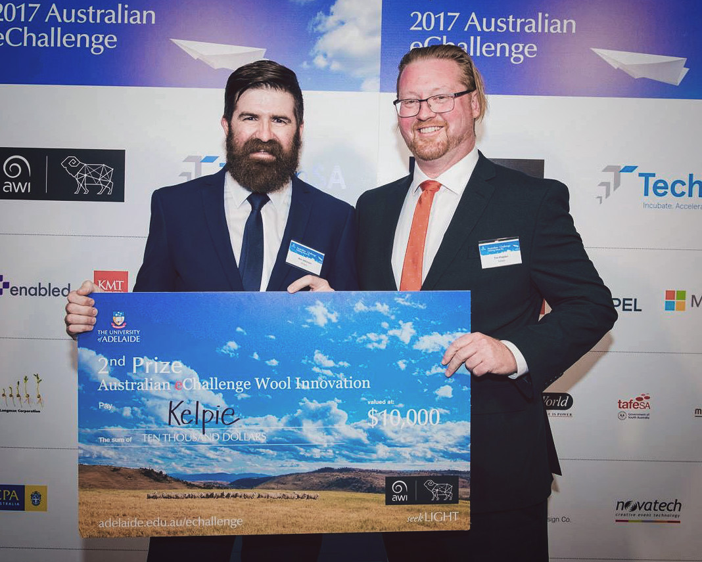
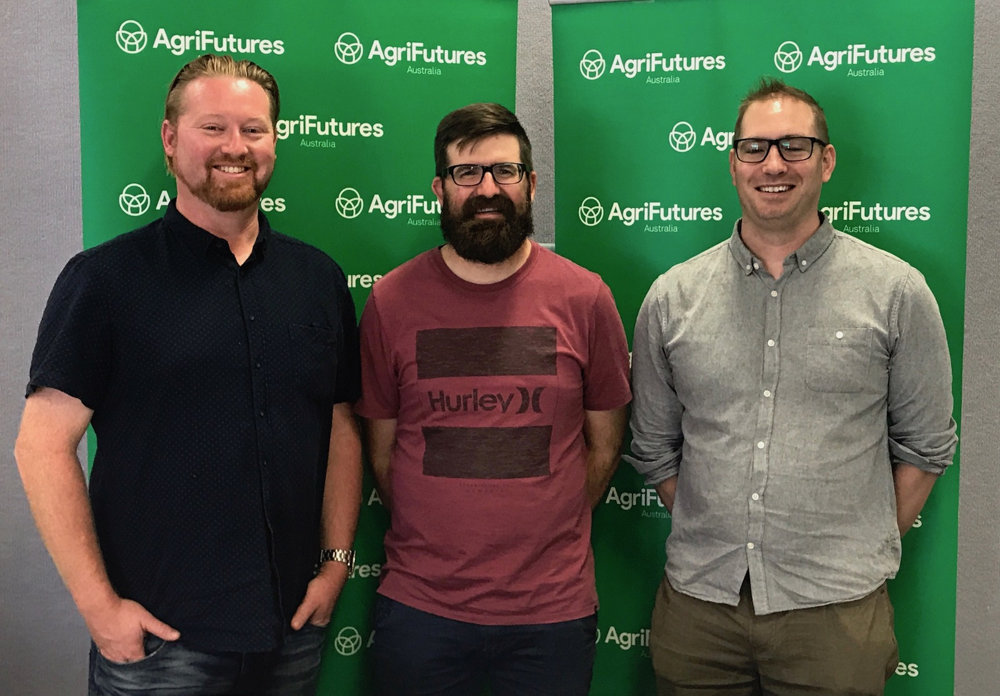

---

title: About Kelpie
layout: about
hero:
- id:
  full-screen: false
  gradient-corner: top
  gradient-side: left
  gradient-color1: "0,0,0,0"
  gradient-color2: "8,25,55,.6"
  image: assets/images/vladimir-malyutin-105283.jpg
  promo-head: About Us
feature:
- id:
  full-screen: false
  gradient-corner: bottom
  gradient-side:
  gradient-color1: "255,83,53,1"
  gradient-color2: "255,83,53,1"
  image:
  text-area:
  - size: centered
    heading: Want to now what Kelpie does?
    text: ""
    button: Explore Features
    button-class: btn-rev
    button-link: features.html
---

### What is Kelpie?

Kelpie is a digital assistant aimed at improving farmers’ access and interaction with the various digital systems, applications and hardware that are becoming available. Kelpie acts as an aggregator for all manner of equipment, data and information and makes it available in a single simple interface.

### Who is Kelpie?
The Kelpie team is Tim Klapdor and Ben Atkinson, two tech guys based in Wagga Wagga, Australia.

### What’s your story?

The idea behind Kelpie was seeded at the at the AgriHack event hosted by Charles Sturt University in 2017. We formed a team and joined the Australian Wool Innovation stream of  Tech eChallenge ran through Adelaide University. Our team came through and grabbed second place in the competition and it was at that point we knew we were onto something. We enrolled in the first cohort of startups in CSU’s AgriTech Incubator program and entered the eChallenge program to develop our idea and put some meat on the bones. Working with a range of experts and mentors Kelpie emerged and was pitched to a panel of experts in Adelaide. We took out second prize again at the rather glamorous gala dinner and awards ceremony - complete with novelty sized check!

### Where to next?

We’re currently in our design and development phase. We’re building out our product ideas and actively developing our MVP. We’re actively seeking opportunities to demonstrate our ideas to potential partners right across the Ag sector. If you’d like to find out more please get in touch in the form below or find us on Twitter, Facebook or LinkedIn.

### AgriHack 2018 Winners

The Kelpie team decided to jump into AgriHack 2018 and sink our teeth into a new challenge and see how we go. Well we did pretty well because we won! Rob has joined us as a new member of the Kelpie Team and we figured this was a great opportunity to test out the new team dynamic - what better way than to throw us all into the pressure cooker of a hack-a-thon. The results were great! We managed to put together a solution to the problem of weighing live chickens - Chickon. [Get in touch if you'd like to know more!](contact.html)
